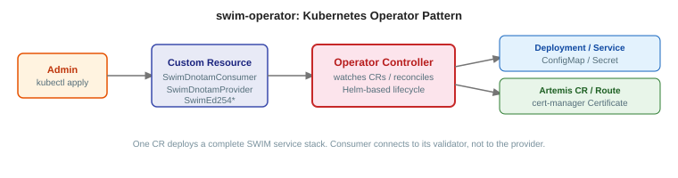

# swim-developer-operator

Kubernetes Operators for deploying and managing SWIM (System Wide Information Management) services. Automates the full lifecycle of DNOTAM and ED-254 components, databases, messaging brokers, certificates, networking, and observability, through Custom Resources.



## Modules

| Module | Description |
|--------|-------------|
| `swim-operator-common` | Shared Go library: domain types, reconciler logic, resource builders, helpers |
| `swim-openshift-operator` | OpenShift Operator: manages CRDs with Routes, AMQ Broker, AMQ Streams, RHBK |
| `swim-kubernetes-operator` | Kubernetes Operator: vendor-neutral alternative using Ingress, cert-manager, upstream images |

## Managed Custom Resources

| CRD Kind | Service | Infrastructure Provisioned |
|----------|---------|---------------------------|
| `SwimDigitalNotamConsumer` | DNOTAM Consumer | MongoDB, Kafka, mTLS, HPA, ServiceMonitor |
| `SwimDigitalNotamProvider` | DNOTAM Provider | PostgreSQL, Artemis, Kafka, mTLS, OIDC, RBAC |
| `SwimDnotamConsumerValidator` | DNOTAM Consumer Validator | MariaDB, Artemis, mTLS, HPA |
| `SwimDnotamProviderValidator` | DNOTAM Provider Validator | MariaDB, mTLS, HPA |

## What gets deployed

One Custom Resource deploys the complete stack: application, database, message broker, certificates, routes/ingress, and observability.

### SwimDigitalNotamProvider

PostgreSQL, ActiveMQ Artemis (AMQP 1.0 with OIDC), Kafka topics (Strimzi), TLS certificates (cert-manager), Routes/Ingress, RBAC, ServiceMonitor.

### SwimDigitalNotamConsumer

MongoDB, Kafka topics, client certificates for mTLS, HPA, ServiceMonitor.

### SwimDnotamConsumerValidator

MariaDB, ActiveMQ Artemis, server/client certificates, Routes/Ingress, HPA.

### SwimDnotamProviderValidator

MariaDB, client certificates, Routes/Ingress, HPA.

## GET STARTED

### Deploy the DNOTAM consumer (fastest path)

If you have an OpenShift cluster with cert-manager, Strimzi, and AMQ Broker installed:

```bash
# 1. Install the operator
oc apply -f install-swim-catalog.yaml

# 2. Create a SWIM CA issuer (if not already present)
oc apply -f docs/swim-kubernetes-operator/samples/ca-issuer.yaml

# 3. Deploy the DNOTAM consumer
oc apply -f docs/swim-kubernetes-operator/samples/dnotam-consumer.yaml
```

The operator provisions MongoDB, Kafka topics, certificates, routes, and the application deployment automatically.

For Kubernetes:

```bash
helm install swim-operator ./charts/swim-kubernetes-operator \
  --namespace swim-operator-system --create-namespace

kubectl apply -f docs/swim-kubernetes-operator/samples/dnotam-consumer.yaml
```

### Verify, happy path

After applying the CR, watch the operator provision resources:

```bash
# OpenShift
oc get swimdigitalnotamconsumer swim-dnotam-consumer -w

# Kubernetes
kubectl get swimdigitalnotamconsumer swim-dnotam-consumer -w
```

The deployment is complete when the CR status shows `READY`. Then verify:

```bash
# Check all pods are running
oc get pods -l app=swim-dnotam-consumer

# Check the consumer health endpoint via the provisioned Route
ROUTE=$(oc get route swim-dnotam-consumer -o jsonpath='{.spec.host}')
curl -s https://${ROUTE}/q/health | jq .status
```

### Local development with Minikube

See [`docs/swim-kubernetes-operator/MINIKUBE_TEST_GUIDE.md`](docs/swim-kubernetes-operator/MINIKUBE_TEST_GUIDE.md) for a complete walkthrough using Minikube.

---

## Quick start

```yaml
apiVersion: apps.swim-developer.github.io/v1alpha1
kind: SwimDigitalNotamConsumer
metadata:
  name: swim-dnotam-consumer
spec:
  certManager:
    issuerName: swim-ca-issuer
    issuerKind: ClusterIssuer
  client:
    config:
      swimServiceBaseURL: "https://provider-api.example.com"
      amqpBrokerHost: "broker.example.com"
      amqpBrokerPort: 443
      dnotamSubscriptions: |
        [
          {
            "topic": "DigitalNOTAMService",
            "eventScenario": ["RWY.CLS", "AD.CLS"],
            "airportHeliport": ["LPPT", "EHAM"]
          }
        ]
```

## OpenShift vs Kubernetes

| Feature | OpenShift Operator | Kubernetes Operator |
|---------|-------------------|---------------------|
| **Installation** | OLM (Operator Lifecycle Manager) | Helm / Kustomize |
| **Ingress** | OpenShift Routes | Kubernetes Ingress |
| **Message Broker** | Red Hat AMQ Broker (supported) | Community Artemis |
| **Streaming** | AMQ Streams (supported) | Community Strimzi |
| **Identity** | Red Hat Build of Keycloak | Community Keycloak |
| **Enterprise Support** | Red Hat | Community |
| **Target Platform** | OpenShift 4.12+ | Kubernetes 1.28+ |

Both operators manage the same Custom Resources and deploy the same application components. The difference is in the underlying infrastructure: the OpenShift variant uses Red Hat certified middleware with enterprise support, while the Kubernetes variant uses upstream community images for maximum portability.

## Prerequisites

- cert-manager Operator
- AMQ Broker Operator (for Provider and Consumer Validator)
- Strimzi Kafka Operator (for Provider and Consumer)
- SWIM CA ClusterIssuer configured
- Keycloak (for Provider OIDC/JAAS authentication)

For OpenShift: OpenShift 4.12+. For vanilla Kubernetes: 1.28+.

## Installation

### Via OLM (OpenShift)

```bash
oc apply -f install-swim-catalog.yaml
```

### Via Helm (Kubernetes)

```bash
helm install swim-operator ./charts/swim-kubernetes-operator \
  --namespace swim-operator-system \
  --create-namespace
```

### Via Makefile

```bash
make install
make deploy IMG=quay.io/masales/swim-operator:latest
```

## Technology

| Component | Technology |
|-----------|------------|
| Language | Go |
| Framework | Operator SDK / Kubebuilder |
| Platforms | OpenShift 4.x, Kubernetes 1.28+ |
| TLS | cert-manager |
| Messaging | ActiveMQ Artemis (AMQ Broker) |
| Streaming | Apache Kafka (AMQ Streams) |
| API Version | `apps.swim-developer.github.io/v1alpha1` |

## Building

```bash
make build     # build both operators
make test      # unit tests for both operators
make lint      # go fmt + go vet on both operators
```

For deploy, bundle, and OLM image targets, run `make help` inside each operator directory:

```bash
cd swim-openshift-operator && make help
cd swim-kubernetes-operator && make help
```

## License

Licensed under the [Apache License 2.0](LICENSE).
